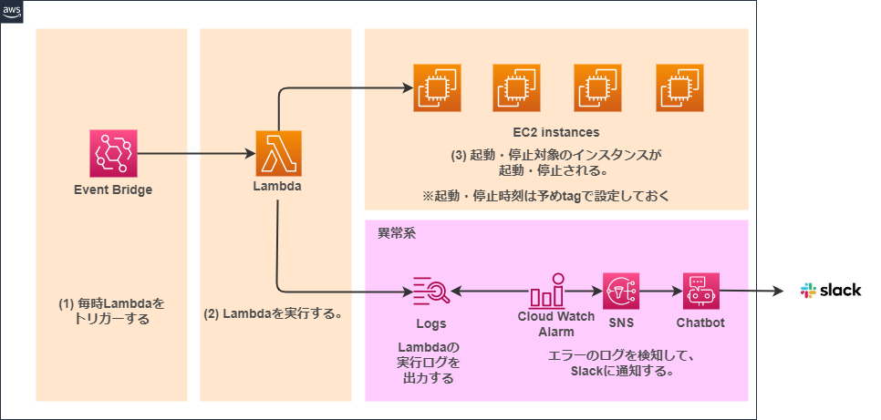

### 概要
* EC2インスタンスを自動起動、停止するLambdaを定期実行する。
* 起動、停止時刻はインスタンスのタグに `start_time` , `stop_time` として指定する。
* `start_time` , `stop_time` は%H:%Mの%Hのみ。（例:00, 23 など）

### 構成図


### 前提条件
* tfstate用S3バケットが作成されていること
* Terraform実行用IAMユーザーが作成されていること
* Lambda実行用IAMロールが作成されていること
* SlackとAWS Chatbotが連携済みであること

### デプロイ手順
- AWSのプロファイルを設定する
```
aws configure --profile dev-terraform

AWS Access Key ID [None]: xxxx
AWS Secret Access Key [None]: xxxx
Default region name [None]: ap-northeast-1
Default output format [None]: json

aws configure list --profile dev-terraform
```
- 環境変数を設定する(プロファイル設定済みの場合は不要)
```
export AWS_ACCESS_KEY_ID=YOURACCESSKEY
export AWS_SECRET_ACCESS_KEY=YOURSECRETKEY
export AWS_DEFAULT_REGION=ap-northeast-1

```

- Terraform実行
```
# 初期設定
cd dev
terraform init -backend-config=dev.tfbackend

# 適用
terraform plan -var-file=dev.tfvars
terraform apply -var-file=dev.tfvars

# 削除
terraform plan -destroy -var-file=dev.tfvars
terraform destroy -var-file=dev.tfvars
```
